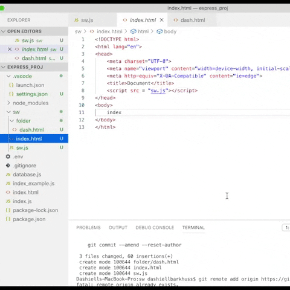
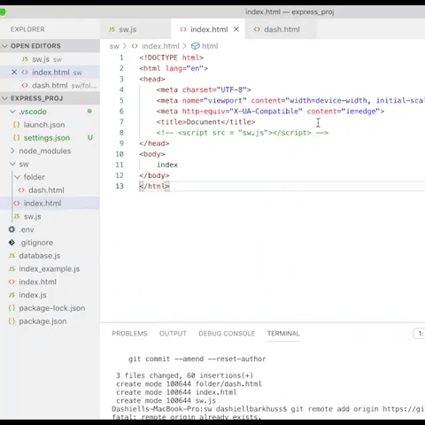

## No Service Worker
**Without** the service workers file, `sw.js`, the app can't load pages while offline:

**With** the service workers file, `sw.js`,  the app loads specified pages while offline:

